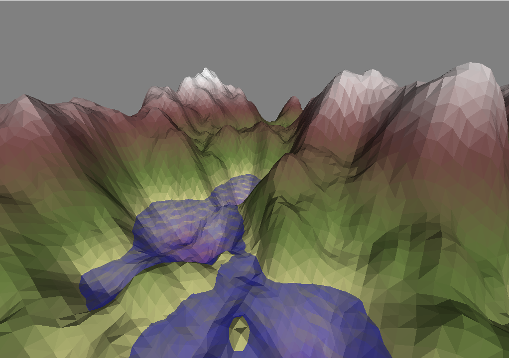
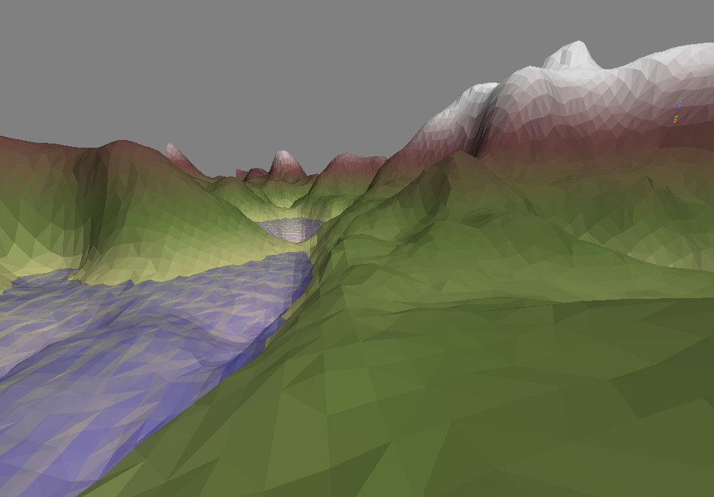

# 3D Terrain - rendering smooth was yesterday
This project was created as a part of the _Computer Graphics_ course at _Reykjavík University_ in 2020. The project renders a 3D low poly terrain with some particle effects. It is written using Python and OpenGL.

The [report](.docs/report.md) and a [gallery](.docs/gallery.md) can be found inside the `.doc` folder. The simulation uses an _Entity Component System_ for the game logic. This architecture has been documented as a part of the [3D-Packman](https://github.com/xFrednet/3D-Packman) project.

## Some example screenshots:

Screenshots can never capture the feeling of exploring projects them self. They also don't capture the water that I've spent quite some time on ^^ 

## Controls
| Type                 | Controls                   |
| -------------------- | -------------------------- |
| Movement controls    | `[W]`, `[A]`, `[S]`, `[D]` |
| Vertical control     | `[SPACE]`, `[SHIFT]`       |
| Rotation controls    | `[<]`, `[^]`, `[v]`, `[>]` |
| Height map selection | `[0]`, `[1]`, ..., `[9]`   |

## Installation
This game uses: 
* PyOpenGL and pygame for rendering
* PyGLM for beautiful math.
* Esper for the ECS architecture
* PyGame as a engine (Note that minimum version `2.0.0.dev12` is required)
* NumPy for some number magic

You can use pip to install these requirements:
* `$ pip install -r requirements.txt`

## Running the Simulation
The simulation can be started with the following comment in the root directory:
* `$ python src/main.py`